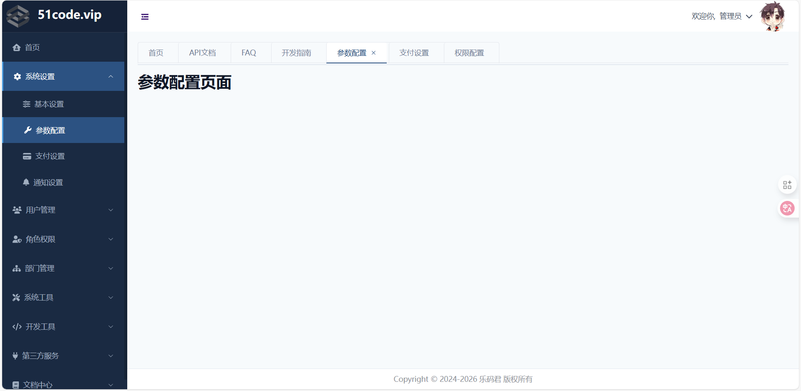
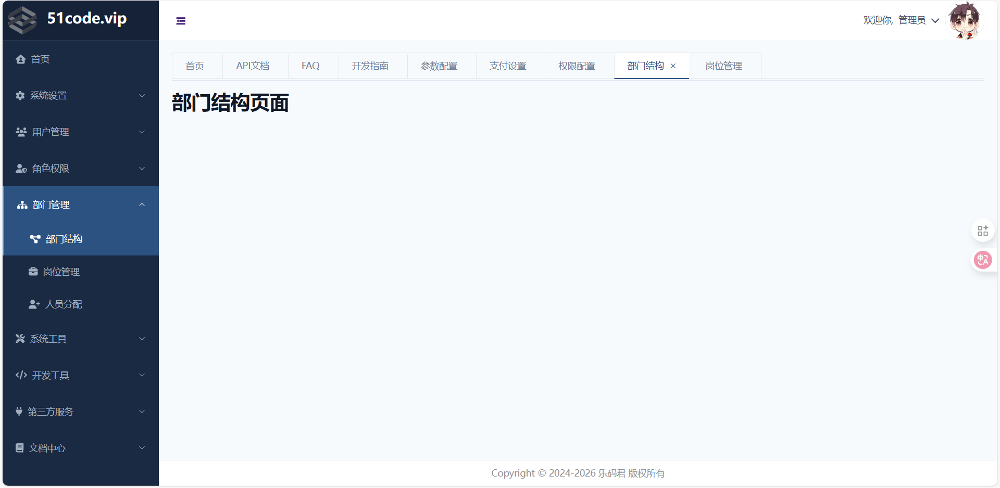
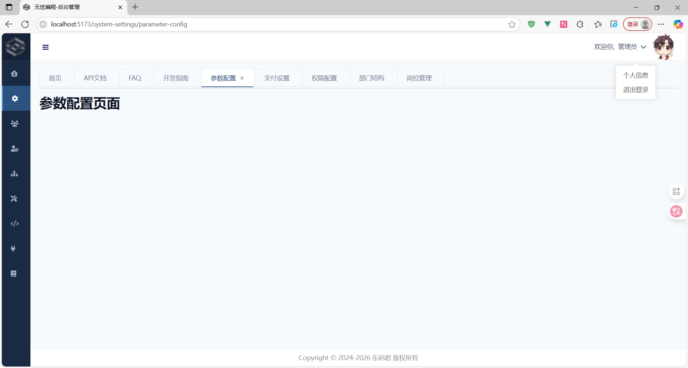
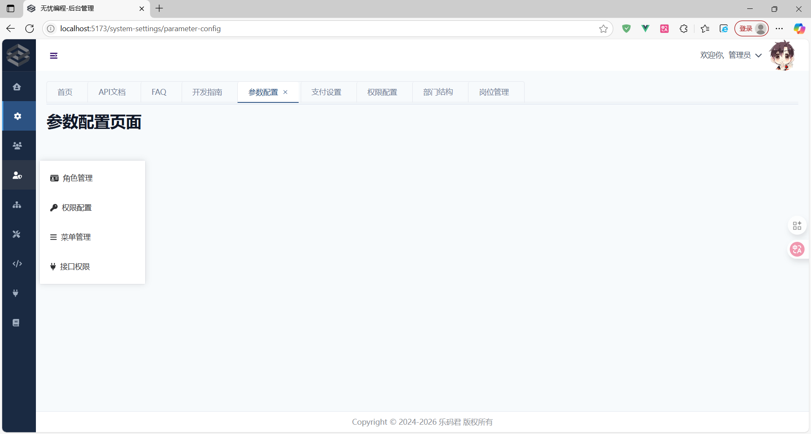

# 项目介绍

> 本项目是一个精简的后台管理页面模板，包含自定义菜单、菜单与标签页的联动，右上角的头像和子菜单定义，对于后台管理项目，可以在此页面的基础上进行二次开发

## 技术栈

- vue3
- vite
- javascript
- pinia
- vue-router
- tailwindcss
- fontawesome
- chart.js

## 分支介绍

- master：基本的框架，不含 axios 封装、登录、注册页面等功能
- dev_v1: 含 axios 封装、登录、注册页面
- dev_v2: 修订了菜单样式和添加了后端管理系统的通用性菜单功能

## 使用方式

```shell
cd vue-vite-admin

npm install

npm run dev
```

## 项目截图

- 菜单展开时：
  

- 菜单选中时
  

- 菜单收缩时：
  

- 菜单收缩悬停时：
  
